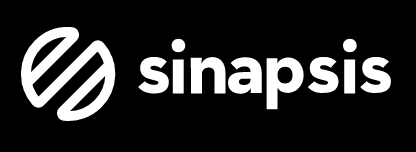
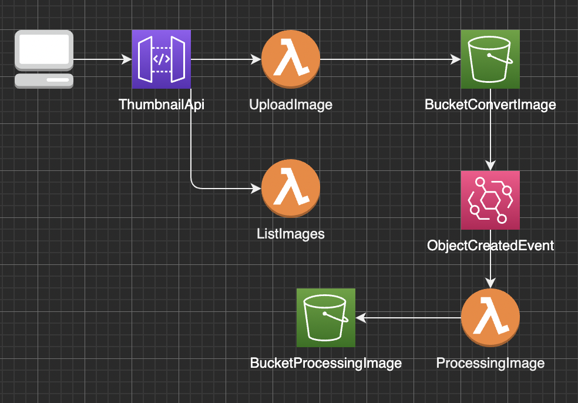
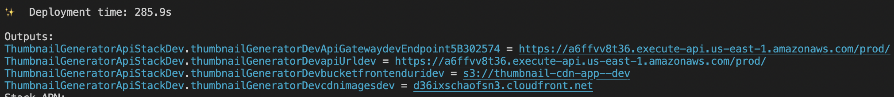
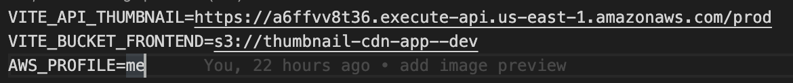

# **Sinapsis Technical PoC**

<a name="readme-top"></a>

<!-- PROJECT LOGO -->
<br />
<div align="center">
  <a href="https://github.com/othneildrew/Best-README-Template">
    
  </a>

  <h3 align="center">Thumbnail generator</h3>

  <p align="center">
    This amazing project allows you to save images and three different dimensions of it
    <br />
    <a href="https://d36ixschaofsn3.cloudfront.net">View Demo</a>
  </p>
</div>


<!-- ABOUT THE PROJECT -->

## About The Project


You can store the images you need, keeping in mind that only JPGE and PNG images are allowed, in addition to the fact that the image cannot be larger than 5MB.

## Thumbnail api


This application was made with aws-cdk, the architecture used was the following:



<!-- GETTING STARTED -->

## Getting Started

In this segment we will show how to deploy thumbnail-api

### Prerequisites

- npm
  ```sh
  npm install npm@latest -g
  ```
- aws-cli
- aws-cdk

### Deployment

To perform the deployment you only have to enter the thumbnail-generator-api/ folder and execute the following commands.

1. Deploy
   ```sh
   npm run deploy
   ```
2. When the process finishes save the output values in the terminal, these will be used as environment variables for the frontend 
   

## Thumbnail ui

This project was built with react JS, it is recommended to use version 16 of node JS.
Enter the thumbnail-generator-ui/ 

### Run locally
  - Install dependencies
  ```sh
    npm install
  ```
  - Run app
  ```sh
    npm run dev
  ```
### Set environment variables
- VITE_API_THUMBNAIL= This variable is the url of the backend api that we deployed in the previous step(thumbnailGeneratorDevapiUrldev).
- VITE_BUCKET_FRONTEND= This variable is used for the deployment of the application in aws cloud front(thumbnailGeneratorDevbucketfrontenduridev).
- AWS_PROFILE= It is only necessary if you want to modify the profile of your AWS account (default)


### Deploy frontend
  - dev
  ```sh
    npm run deploy:dev 
  ```
  - prod
  ```sh
    npm run deploy:prod 
  ```
<!-- USAGE EXAMPLES -->

<!-- ROADMAP -->

<!-- CONTRIBUTING -->
<!-- LICENSE -->

<!-- MARKDOWN LINKS & IMAGES -->
<!-- https://www.markdownguide.org/basic-syntax/#reference-style-links -->

[contributors-shield]: https://img.shields.io/github/contributors/i3mDevep/Best-README-Template.svg?style=for-the-badge
[contributors-url]: https://github.com/i3mDevep/proof-of-concept/graphs/contributors
[forks-shield]: https://img.shields.io/github/forks/othneildrew/Best-README-Template.svg?style=for-the-badge
[forks-url]: https://github.com/sinapsis-co/proof-of-concept/network/members
[stars-shield]: https://img.shields.io/github/stars/othneildrew/Best-README-Template.svg?style=for-the-badge
[stars-url]: https://github.com/othneildrew/Best-README-Template/stargazers
[issues-shield]: https://img.shields.io/github/issues/othneildrew/Best-README-Template.svg?style=for-the-badge
[issues-url]: https://github.com/othneildrew/Best-README-Template/issues
[license-shield]: https://img.shields.io/github/license/othneildrew/Best-README-Template.svg?style=for-the-badge
[license-url]: https://github.com/othneildrew/Best-README-Template/blob/master/LICENSE.txt
[linkedin-shield]: https://img.shields.io/badge/-LinkedIn-black.svg?style=for-the-badge&logo=linkedin&colorB=555
[linkedin-url]: https://linkedin.com/in/othneildrew
[product-screenshot]: images/app-mobile.png
[next.js]: https://img.shields.io/badge/next.js-000000?style=for-the-badge&logo=nextdotjs&logoColor=white
[next-url]: https://nextjs.org/
[typescript.js]: https://www.typescriptlang.org
[typescript-url]: https://img.shields.io/badge/-Typescript-black?logo=typescript
[react.js]: https://img.shields.io/badge/React-20232A?style=for-the-badge&logo=react&logoColor=61DAFB
[react-url]: https://reactjs.org/
[node.js]: https://nodejs.org/en/
[node-url]: https://img.shields.io/badge/Node-026e00?style=for-the-badge&logo=node&logoColor=61DAFB
[vue.js]: https://img.shields.io/badge/Vue.js-35495E?style=for-the-badge&logo=vuedotjs&logoColor=4FC08D
[vue-url]: https://vuejs.org/
[angular.io]: https://img.shields.io/badge/Angular-DD0031?style=for-the-badge&logo=angular&logoColor=white
[angular-url]: https://angular.io/
[svelte.dev]: https://img.shields.io/badge/Svelte-4A4A55?style=for-the-badge&logo=svelte&logoColor=FF3E00
[svelte-url]: https://svelte.dev/
[laravel.com]: https://img.shields.io/badge/Laravel-FF2D20?style=for-the-badge&logo=laravel&logoColor=white
[laravel-url]: https://laravel.com
[bootstrap.com]: https://img.shields.io/badge/Bootstrap-563D7C?style=for-the-badge&logo=bootstrap&logoColor=white
[bootstrap-url]: https://getbootstrap.com
[jquery.com]: https://img.shields.io/badge/jQuery-0769AD?style=for-the-badge&logo=jquery&logoColor=white
[jquery-url]: https://jquery.com
